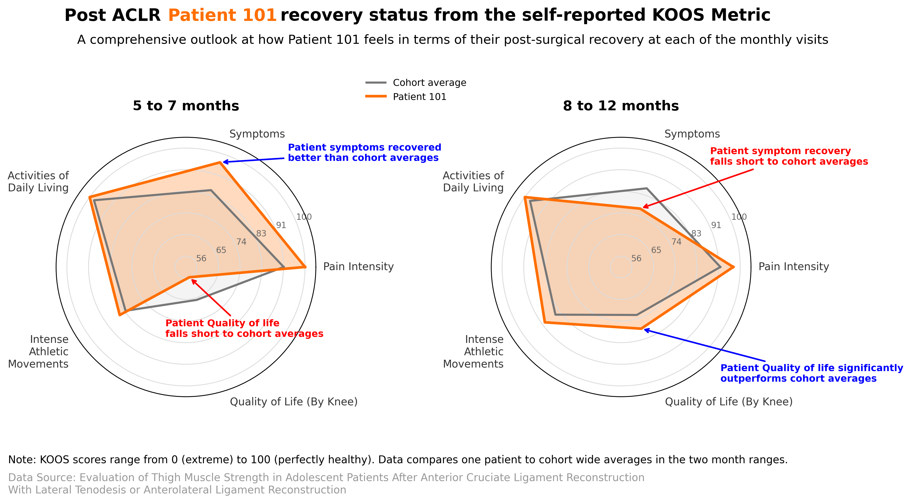
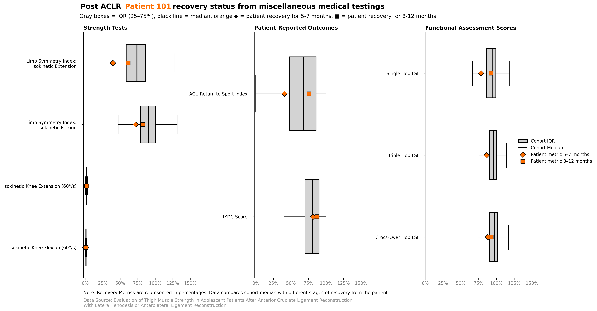
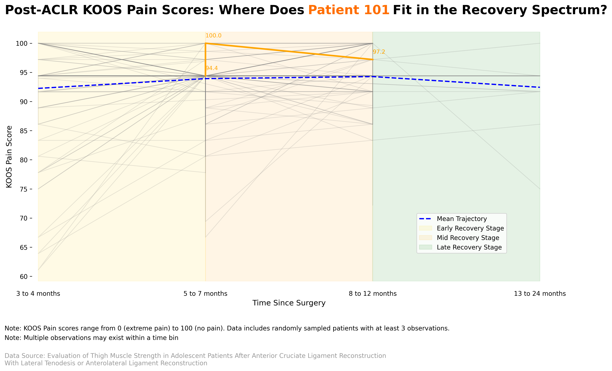

## Final Project - DS2023

### Meet the team: Ethan Vinith, Alieen

-----------------------------------------

This project focused on patient recovery post ACLR surgery, by utilizing averages of recovery times and tragetories to track the progress of a specific patient. In this project we developed several visualizations comparing our specific patient to the average recovery related information of his peer group. Through working on this project we learned different visualization methods of comparison with a group to provide insights for an individual. Additionally while we worked on developing these visualizations we learned the importance of full exploration of all the variables in your data set, especially in a data set like the one we were working with where there were numerous variables that addressed similar things, such as time. These skills will be pertinent to our careers as data scientists as methods of comparison of means and averages can be applied across all types of data. Additionally the foundational skills of developing and fine-tuning visualizations can be applied in many other project reports or presentations, even research posters, down the line in our careers. 

